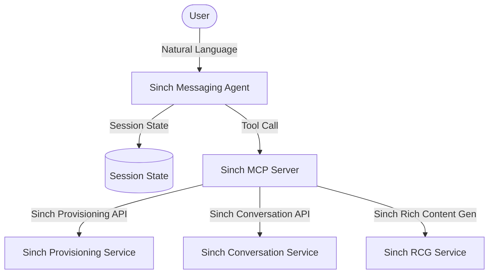
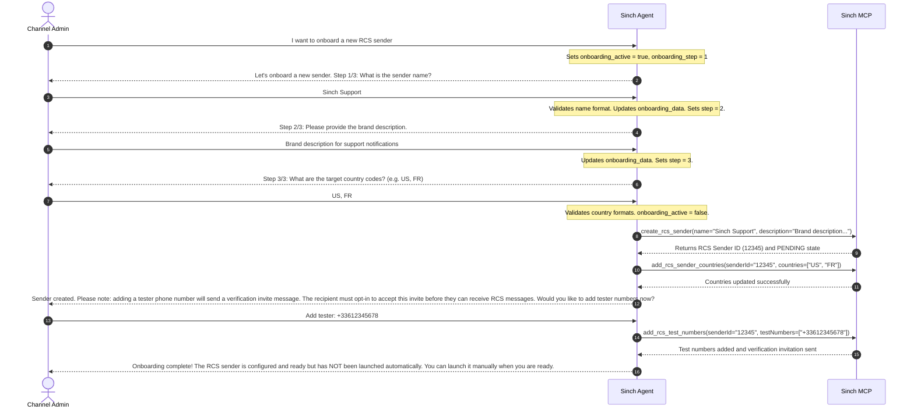
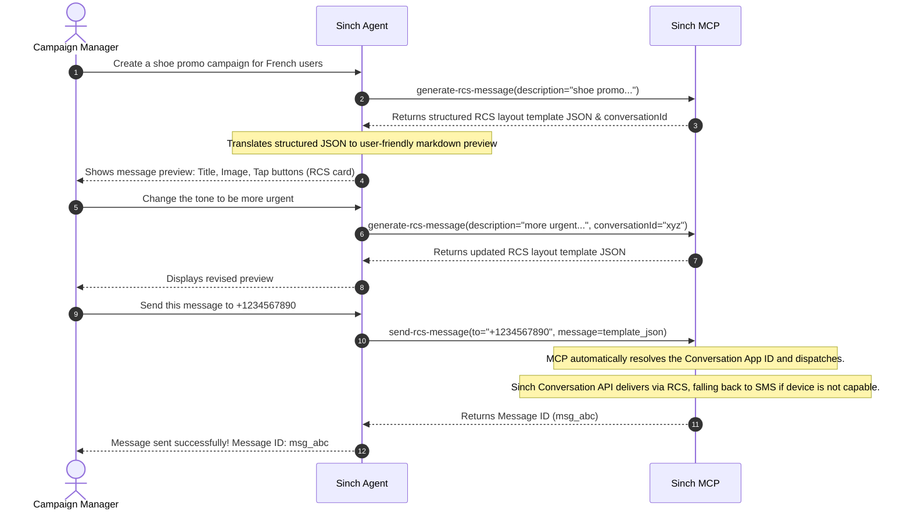
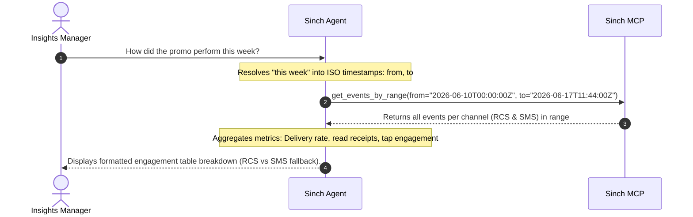

# Sinch Messaging Agent Design Document

## 1. Requirements Analysis
> **Goal**: Clarify what we are building and why.

*   **User Problem**: Enterprise teams need to manage RCS and SMS communication channels, design rich-media message campaigns, and track delivery performance directly within Gemini Enterprise without manually navigating complex Sinch APIs or console interfaces.
*   **Target Outcome**: A natural-language interface in Gemini Enterprise allowing admins to onboard senders, campaign managers to author and dispatch rich content with automated SMS fallbacks, and insights managers to retrieve engagement analytics.
*   **Key Constraints**:
    *   **Budget/Cost**: Low cost, leveraging `gemini-2.5-flash` for agent reasoning.
    *   **Latency**: Interactive multi-turn onboarding and messaging generation loop.
    *   **Tools**: Exclusively uses the Sinch MCP server to access Sinch platform APIs.
    *   **Authorization**: Scopes and roles are verified downstream at the Sinch MCP server level using the user's authenticated JWT credentials.
*   **clarification_log**:
    *   *Q: How should user roles/scopes be managed?* -> *A: Role authorization is checked downstream at the Sinch level using the user's authenticated JWT.*
    *   *Q: How do we handle multi-turn onboarding questionnaire flow?* -> *A: Managed via root agent session state.*
    *   *Q: Should we collect all RCS onboarding fields?* -> *A: Skip brand logos, privacy links, and regulatory details for now; the MCP server fills them with defaults.*
    *   *Q: How are campaign messages sent?* -> *A: Sent to a single phone number, one by one (no audience list retrieval for now).*
    *   *Q: How is SMS fallback configured and resolved?* -> *A: Fallback rules are pre-configured on the Sinch platform Conversation App. The `send-rcs-message` tool auto-detects this app at runtime, and the Conversation API automatically falls back to SMS if the recipient device does not support RCS.*
    *   *Q: Does the agent automatically launch the RCS sender?* -> *A: No, the agent will configure target countries and register testers, but will not trigger the launch request automatically. It will instruct the user on how to proceed manually.*
    *   *Q: What warning is required for testers?* -> *A: The agent must explicitly warn the administrator BEFORE they add tester numbers that doing so sends a verification invite message, and that the recipient MUST opt-in (accept the invite) to receive RCS messages.*

---

## 2. Architecture Design
> **Goal**: Define the structure (Agents, Tools, Flow).

### 2.1 High-Level Strategy
*   **Pattern**: Single Agent Pattern
*   **Rationale**: Simplifies context sharing between insights tracking and campaign design. Eliminates multi-agent routing overhead and is fully scalable since role validation is performed downstream at the Sinch platform level.

### 2.2 System Diagram (Logical)

### 2.3 Components
#### **A. Agents**
| Name | Type | Model | Role/Persona |
| :--- | :--- | :--- | :--- |
| `root_agent` | `LlmAgent` | `gemini-2.5-flash` | An assistant configured to manage Sinch senders, generate rich campaigns with RCG, send messages with automatic fallback, and track analytics. |

#### **B. State Schema (`session.state`)**
| Key | Type | Description | Persistence |
| :--- | :--- | :--- | :--- |
| `onboarding_active` | `bool` | Flag indicating if RCS sender onboarding is in progress | Session |
| `onboarding_step` | `int` | Current onboarding question index (1 to 3) | Session |
| `onboarding_data` | `dict` | Temporary store for collected sender details (name, description, countries) | Session |
| `last_generated_card` | `dict` | Last generated RCS card structure for iterative refinement | Session |

#### **C. Tools**
| Tool Name | Title | Description | Input Schema |
| :--- | :--- | :--- | :--- |
| `whoami` | Who am I | Returns the Sinch subproject and user identity from the OAuth token. | None |
| `list_active_numbers` | List active numbers | Lists active phone numbers belonging to the subproject. | `pageSize` (optional) |
| `create_rcs_sender` | Create RCS sender | Creates an RCS sender using brand details. Brand assets are pre-filled. | `name`, `description` |
| `add_rcs_sender_countries` | Add countries to RCS sender | Sets target country codes (ISO 3166-1 alpha-2) on the sender. | `senderId`, `countries` |
| `add_rcs_test_numbers` | Add test numbers to RCS sender | Adds tester phone numbers in E.164 format. | `senderId`, `testNumbers` |
| `launch_rcs_sender` | Launch RCS sender | Begins the official launch process for the RCS sender. | `senderId` |
| `generate-rcs-message` | Generate RCS message | Generates or refines an RCS rich message card template via RCG. | `description`, `conversationId` (optional) |
| `send-rcs-message` | Send RCS message | Sends a rich message via the Conversation App (auto-resolving app ID/fallback). | `to`, `message`, `appId` (optional) |
| `get_message_events` | Get message events | Returns delivery and engagement events for a message ID. | `messageId` |
| `get_events_by_range` | Get events by time range | Returns all messaging events for a time window (ISO 8601). | `from`, `to` |

---

### 2.4 Execution Flow (Sequence)

#### **Flow 1: Channel Administrator Onboarding (RCS Sender Configuration)**

#### **Flow 2: Campaign Manager Generation & Delivery (Sinch Automatic Fallback)**

#### **Flow 3: Insights Manager Querying & Reporting**

---

## 3. Evaluation Plan
> **Goal**: Define how we verify success.

### 3.1 Strategy
*   **Methodology**: Automated end-to-end verification via PyTest using mock MCP server responses.
*   **Tools**: `adk eval`, PyTest.

### 3.2 Metrics
1.  **Onboarding Sequence Compliance**: Verifying the root agent invokes `create_rcs_sender`, `add_rcs_sender_countries`, and `add_rcs_test_numbers` in the correct order, and explicitly warns the user about tester invitation and opt-in rules before requesting the phone numbers.
2.  **No Automatic Launch**: Confirming the agent does NOT invoke `launch_rcs_sender` automatically during the onboarding sequence.
3.  **Message Delivery Dispatch**: Verifying `send-rcs-message` receives the correct target recipient and generated template JSON.
4.  **Refinement Context**: Ensuring refinement queries properly forward previous message context `conversationId` to RCG.

### 3.3 Test Scenarios
#### **Scenario 1: Interactive Onboarding Flow**
*   **Input**: "I want to onboard a new RCS sender" -> "Sinch Support" -> "Description" -> "US, FR" -> "+33612345678"
*   **Expected Output**: The sequence of tools called is: `create_rcs_sender` -> `add_rcs_sender_countries` -> `add_rcs_test_numbers`. A warning message regarding tester invitation and opt-in is displayed to the user prior to adding the numbers.

#### **Scenario 2: Campaign Delivery**
*   **Input**: "Send this message to +1234567890"
*   **Expected Behavior**: `send-rcs-message` tool is invoked with `to: "+1234567890"` and `message` template data.

---

## 4. Development & Testing Considerations
> **Goal**: Document environment-specific behaviors and setup.

### 4.1 Environment Differences
*   **Production**: Role-based action access is verified by the Sinch MCP server dynamically checking user scopes inside the Google Workspace JWT.
*   **Local Development**: Run `adk web` using a mock token containing variable scopes (`ChannelAdmin`, `CampaignManager`, `InsightsManager`) to test local downstream behavior.

### 4.2 Local Setup
*   Ensure the virtual environment is activated: `source .venv/bin/activate`
*   Define the Sinch MCP server connection parameters in `mcp_agent/agent.py`.
