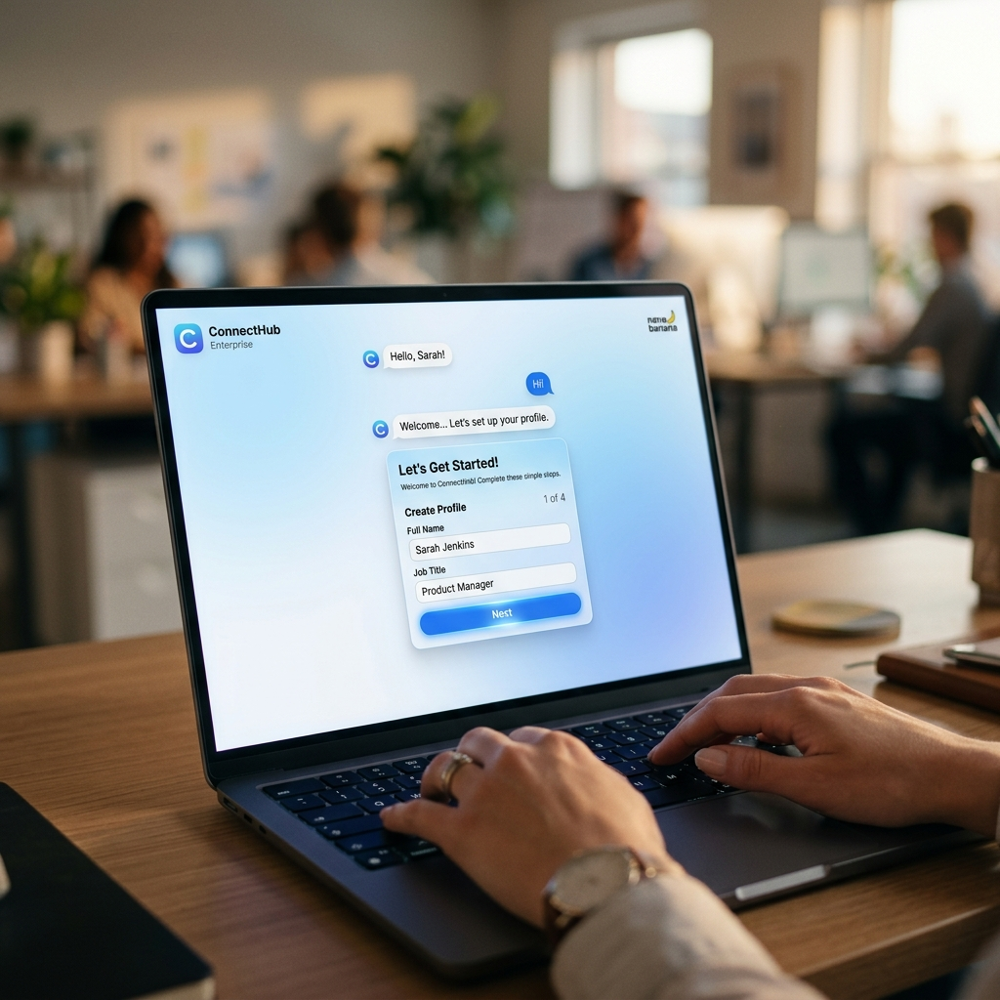
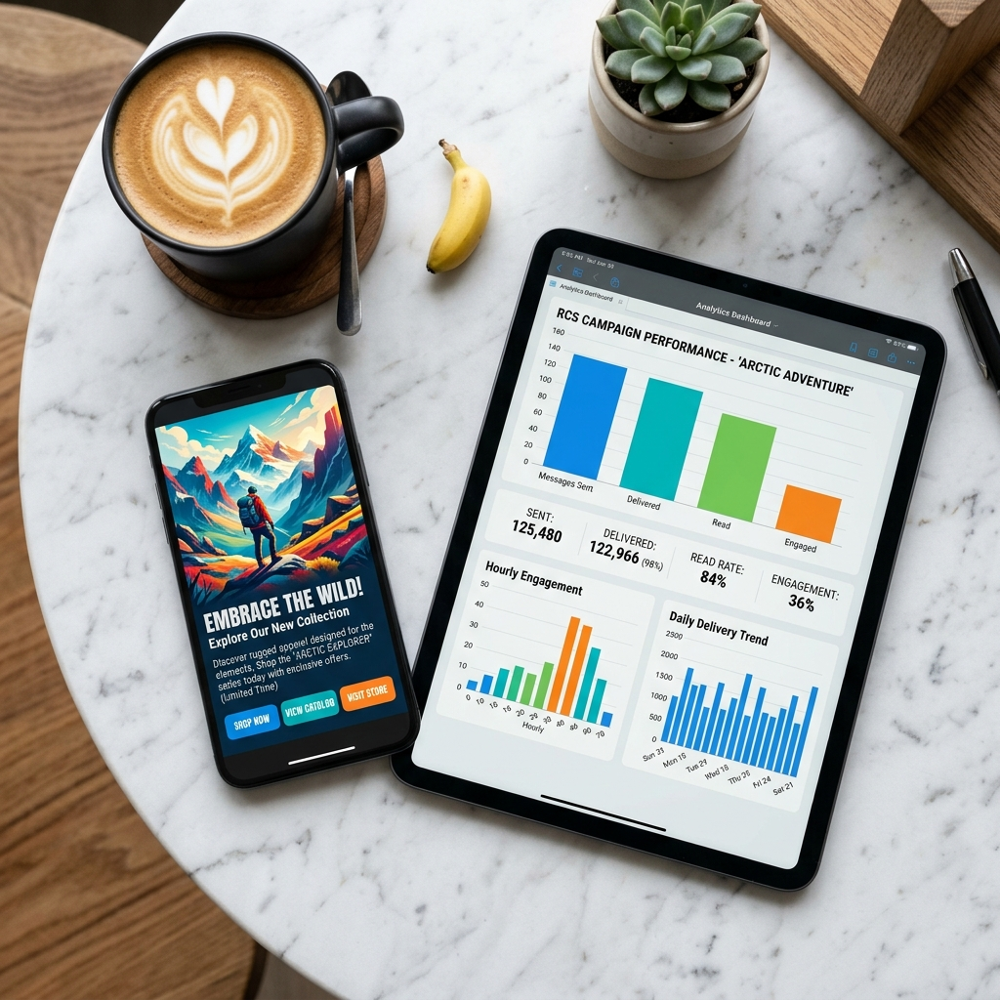

# Your Messaging Team Just Got a Superpower

---

There's a moment every marketing manager dreads. It's a Tuesday afternoon. You have a product launch tomorrow morning. The RCS channel needs to be live in three countries. The campaign creative has to be reviewed, approved, and delivered to 50,000 customers. And the last time anyone checked the message delivery report, nobody could figure out why 12% of sends were failing silently.

You open a dozen browser tabs. You ping the engineering team. You scroll through documentation you've read four times before. And somewhere in that chaos — the window to launch cleanly, confidently, and on time — quietly closes.

This is the reality for enterprise messaging teams everywhere. And it has been, for far too long.

---

## Today, We're Changing That Forever.

**Introducing the Sinch Messaging Agent** — an AI-powered assistant built natively inside Gemini Enterprise that lets your team onboard RCS channels, generate and deliver messaging campaigns, and track performance analytics, all through a simple, guided conversation.

No engineering tickets. No tab overload. No decoding API documentation at midnight.

Just you, your goal, and an intelligent agent that knows exactly how to get there.

---

## How It Works — Beautifully Simple

The Sinch Messaging Agent lives right inside your Gemini Enterprise workspace. It's always there, always ready, and it speaks plain English. Here's what that looks like in practice:

### 📡 You just say "Onboard a new RCS sender."

And the agent walks you through everything — your brand name, your description, your target markets — one elegant step at a time. No forms to hunt down. No API keys to configure manually. Within minutes, your RCS sender is live and verified, with tester numbers added and a launch button ready when you are.

### 📣 You just say "Run a summer sale campaign."

The agent generates a stunning RCS rich card — image, headline, description, action buttons — tuned to your brief. You see a live preview right in the chat. You refine it with a sentence. You approve it. It goes. Your customers receive a beautifully rendered message experience that drives real action.

### 📊 You just say "Show me last week's campaign performance."

In seconds, you're looking at a structured report: messages sent, delivered, read, and engaged with — broken down by RCS versus SMS fallback. Not a raw data dump. A clear, actionable picture of what's working and what needs attention.

---

## The Deeper Impact

Features are easy to describe. But what the Sinch Messaging Agent actually gives your team is something harder to measure and far more valuable: **creative confidence**.

When the operational friction disappears — when you don't have to spend half your day navigating systems, chasing approvals, or debugging delivery pipelines — something remarkable happens. Your team starts thinking bigger. They run more campaigns. They experiment with new markets. They catch delivery issues before they become crises. They spend their time on *strategy* instead of *survival*.

That's not a productivity gain. That's a transformation in how your team works.

There's a reason the best enterprise tools feel invisible. The greatest technology gets out of the way and lets the humans do what humans do best: create, connect, and move fast.

---

## The Beginning of Something Bigger

We are at the very early days of AI agents that don't just answer questions — but *take action* inside the systems enterprises rely on every day. The Sinch Messaging Agent is a glimpse of what that future looks like: intelligent, interactive, and deeply integrated into the workflow.

Imagine a world where every channel goes live in minutes. Where every campaign is perfectly crafted and instantly dispatched. Where every team member — from a junior coordinator to a VP of Marketing — has the same capability at their fingertips, regardless of technical expertise.

That world is not coming. It's here.

---

## Try It Today

The Sinch Messaging Agent is available now inside **Gemini Enterprise**. Open a new conversation, say hello, and see what your team can do when the technology finally works for them.

> *"The people who are crazy enough to think they can change the world are the ones who do."*  
> — Steve Jobs

The messages that move the world are sent by people who never stop moving forward.

**Start sending.**

---

*Built with Google Agent Development Kit (ADK) · Powered by Gemini 2.5 Pro · Deployed on Vertex AI Agent Engine · Integrated with Sinch RCS & SMS APIs via MCP*
