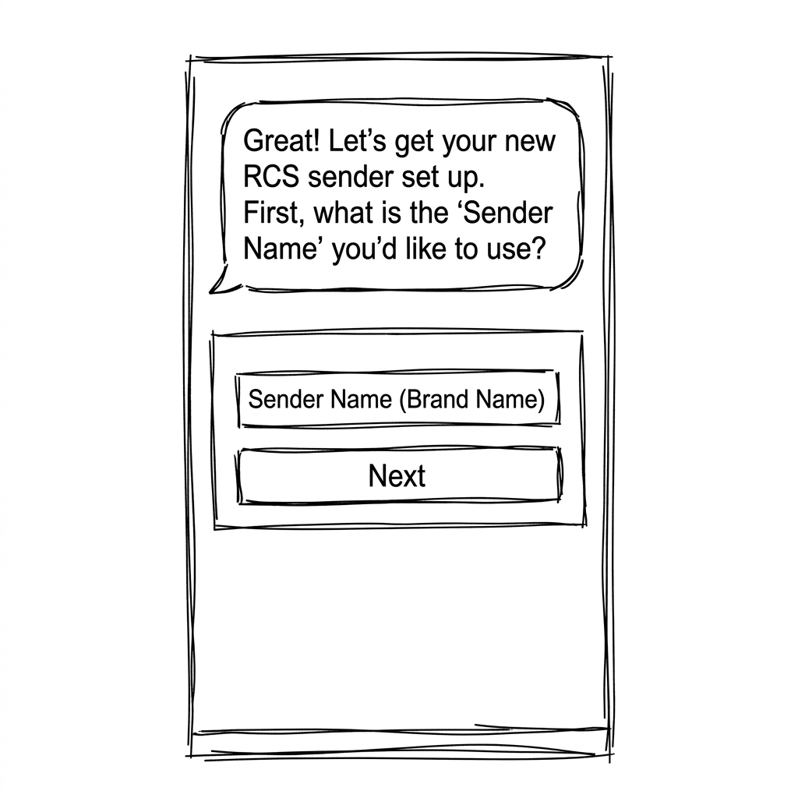
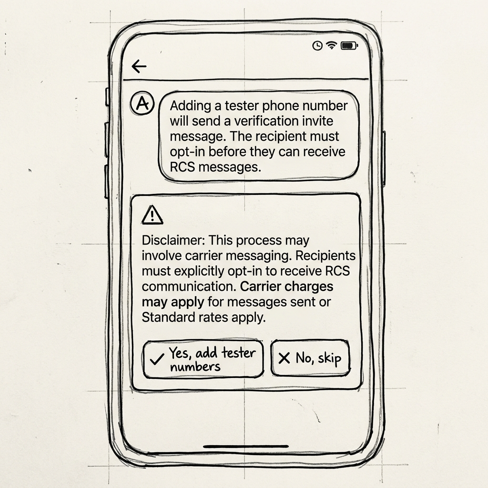
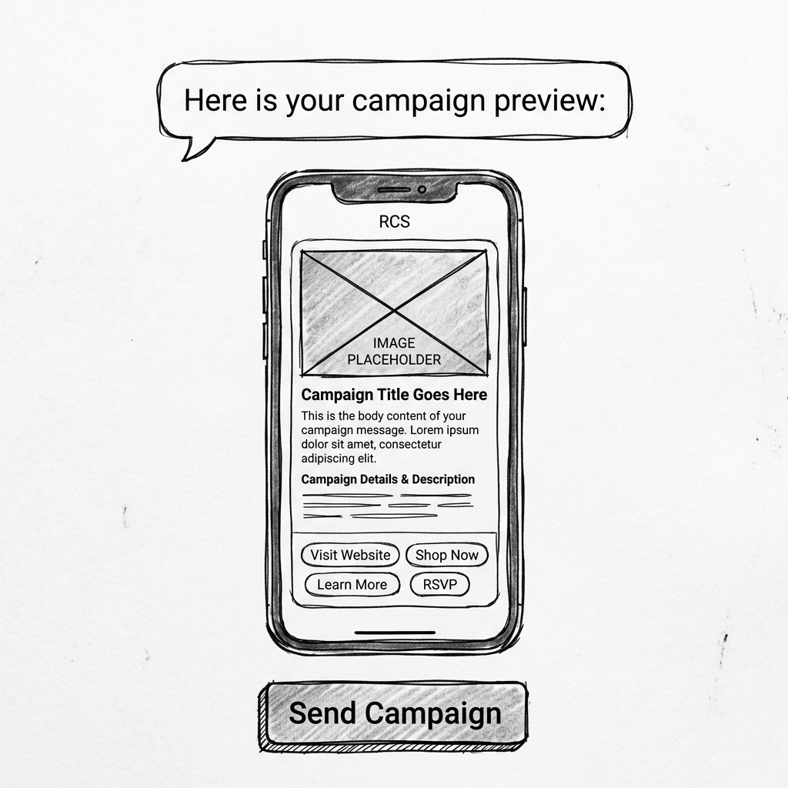
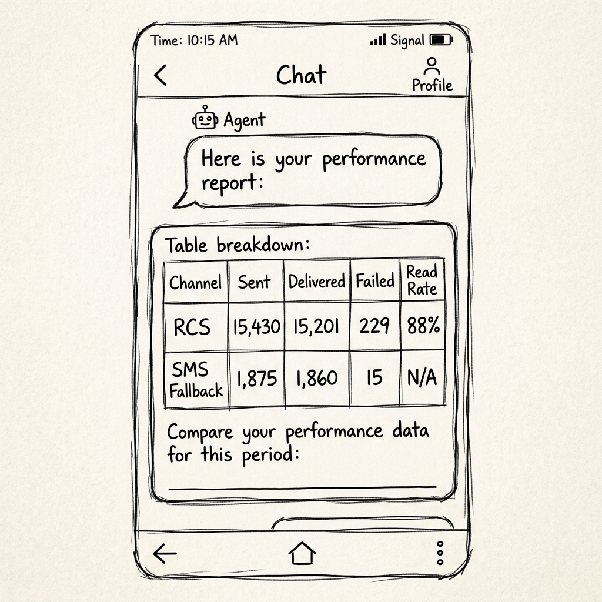

# A2UI UX Design Document: Sinch Messaging Agent

This document defines the user experience and component mapping for the **Sinch Messaging Agent** to enable A2UI (Agent-Driven User Interface) interactions in Gemini Enterprise. It bridges natural language conversation with structured visual controls.

---

## 1. Interaction Flows

### Flow 1: Channel Administrator RCS Onboarding
**Goal**: Guide the user step-by-step to onboard a new RCS sender, configure target countries, display the opt-in warning, collect tester numbers, and offer a manual launch mechanism.

#### Step 1.1: welcome and Name Collection
*   **User Intent**: Request to configure or onboard a new RCS sender.
*   **Conversational response**: *"Great! Let's get your new RCS sender set up. First, what is the 'Sender Name' (display/brand name) you'd like to use?"*
*   **A2UI Components**:
    *   `Card` containing:
        *   `Text` (Header): "RCS Onboarding: Step 1 of 3"
        *   `TextField` (Label: "Sender Name", ID: "sender_name_input", Placeholder: "e.g., Sinch Support")
        *   `Button` (Label: "Next", Action: Submit sender name to state)
*   **Visual Wireframe**:
    

#### Step 1.2: Brand Description Collection
*   **User Intent**: Provide the sender name.
*   **Conversational response**: *"Okay, [Sender Name] it is. Next, please provide a short 'Brand Description'."*
*   **A2UI Components**:
    *   `Card` containing:
        *   `Text` (Header): "RCS Onboarding: Step 2 of 3"
        *   `Text` (Info): "Sender Name: [Sender Name]"
        *   `TextField` (Label: "Brand Description", ID: "brand_desc_input", Placeholder: "Provide a short description of this channel")
        *   `Button` (Label: "Next", Action: Submit brand description to state)

#### Step 1.3: Country Codes Collection
*   **User Intent**: Provide the brand description.
*   **Conversational response**: *"Got it. Now, which 'Country Codes' should this RCS sender target? I recommend including 'FR' (France) as the regulatory questionnaire defaults to it."*
*   **A2UI Components**:
    *   `Card` containing:
        *   `Text` (Header): "RCS Onboarding: Step 3 of 3"
        *   `Text` (Info): "Configure target regions. Select from common countries or add custom comma-separated ISO alpha-2 codes."
        *   `Row` containing:
            *   `CheckBox` (Label: "France (FR)", Value: true)
            *   `CheckBox` (Label: "United States (US)", Value: false)
            *   `CheckBox` (Label: "United Kingdom (GB)", Value: false)
        *   `TextField` (Label: "Other Countries (optional)", ID: "custom_countries_input", Placeholder: "e.g., DE, CA")
        *   `Button` (Label: "Create Sender", Action: Call `create_rcs_sender` and `add_rcs_sender_countries`)

#### Step 1.4: Tester Registration & Disclaimer Warning
*   **User Intent**: System successfully creates the sender and adds countries; prompts if user wants to add testers.
*   **Conversational response**: *"The RCS sender has been created and target countries added. **Please note: adding a tester phone number will send a verification invite message. The recipient must opt-in (accept this invite) before they can receive any RCS messages.** Would you like to add tester phone numbers now?"*
*   **A2UI Components**:
    *   `Card` (Alert / Warning style) containing:
        *   `Text` (Title): "⚠️ Tester Verification Warning"
        *   `Text` (Body): "Adding numbers dispatches a carrier-level verification invitation. Testers must explicitly accept this invitation on their mobile devices before RCS delivery is active."
        *   `MultipleChoice` (ID: "add_testers_choice", Options: ["Yes, add tester numbers", "No, skip for now"])
*   **Visual Wireframe**:
    

#### Step 1.4b: Tester Numbers Input (Conditional on "Yes")
*   **User Intent**: Choose to add tester numbers.
*   **Conversational response**: *"Please enter the E.164 phone numbers for the testers (comma-separated, e.g. +33612345678)."*
*   **A2UI Components**:
    *   `Card` containing:
        *   `TextField` (Label: "Tester Phone Numbers", ID: "tester_numbers_input", Placeholder: "+33612345678, +1234567890")
        *   `Button` (Label: "Submit Testers", Action: Call `add_rcs_test_numbers`)

#### Step 1.5: Completion and Manual Launch Trigger
*   **User Intent**: Skip or finish adding tester numbers.
*   **Conversational response**: *"Understood. The RCS sender 'Sinch Support' is configured and ready. You can launch it manually whenever you are ready."*
*   **A2UI Components**:
    *   `Card` containing:
        *   `Text` (Header): "Sender Onboarding Complete"
        *   `Text` (Info): "Sender ID: [senderId]\nStatus: PENDING_REGULATORY"
        *   `Button` (Label: "🚀 Launch RCS Sender Now", Action: Call `launch_rcs_sender`, Color: Primary/Accent)

---

### Flow 2: Campaign Manager Generation & Delivery
**Goal**: Enable campaign managers to generate, refine, preview, and dispatch rich-media RCS messages.

#### Step 2.1: Campaign Prompt & Live Preview
*   **User Intent**: User requests a new campaign (e.g. "Create a summer sale promo for running shoes").
*   **Conversational response**: *"Here is your campaign preview:"*
*   **A2UI Components**:
    *   `Card` (Mock Phone Container Card) representing the RCS message structure:
        *   `Image` (Media block showing campaign banner from URL)
        *   `Text` (Bold header for Campaign Title)
        *   `Text` (Body text for Campaign Details)
        *   `Row` (Suggestion Action Chips):
            *   `Button` (Style: Chip/Secondary, Label: "Shop Now")
            *   `Button` (Style: Chip/Secondary, Label: "View Details")
    *   `Row` (Orchestration controls):
        *   `Button` (Label: "Refine Tone/Urgency", Action: Focus conversational input)
        *   `Button` (Label: "Proceed to Send", Action: Show recipient configuration card)
*   **Visual Wireframe**:
    

#### Step 2.2: Campaign Delivery Settings
*   **User Intent**: Click "Proceed to Send".
*   **Conversational response**: *"Who should receive this campaign? Provide the target phone number."*
*   **A2UI Components**:
    *   `Card` containing:
        *   `Text` (Header): "Send Campaign Message"
        *   `TextField` (Label: "Recipient Phone Number (E.164)", ID: "recipient_phone_input", Placeholder: "e.g., +33612345678")
        *   `Text` (Note): "Note: Sinch will automatically manage SMS fallback if the recipient device does not support RCS."
        *   `Button` (Label: "Deliver Campaign", Action: Call `send-rcs-message`)

---

### Flow 3: Insights Manager Querying & Reporting
**Goal**: Display high-fidelity messaging analytics, event breakdowns, and delivery performance.

#### Step 3.1: Performance Analytics Report
*   **User Intent**: Ask for statistics (e.g., "Show me the performance report for this week").
*   **Conversational response**: *"Here is your performance report:"*
*   **A2UI Components**:
    *   `Card` containing:
        *   `Text` (Header): "Messaging Performance Breakdown"
        *   `Text` (Sub-header): "Range: [StartDate] to [EndDate]"
        *   `Row` containing key metrics counters:
            *   `Card` (Metrics: "Sent: 17,305")
            *   `Card` (Metrics: "Delivered: 17,061 (98.6%)")
            *   `Card` (Metrics: "Failed: 244")
        *   `Tabs` (ID: "channel_tabs", Options: ["Overview", "RCS", "SMS Fallback"])
        *   `Table` (Breakdown):
            *   Columns: `["Channel", "Sent", "Delivered", "Failed", "Read Rate"]`
            *   Rows:
                *   `["RCS", "15,430", "15,201", "229", "88%"]`
                *   `["SMS Fallback", "1,875", "1,860", "15", "N/A"]`
*   **Visual Wireframe**:
    

---

## 2. State & Data Requirements

To populate these components dynamically, the agent's `session.state` requires the following fields:

*   `onboarding_data`: Dict containing `{ "name": str, "description": str, "countries": list[str] }` (Step 1.1-1.3).
*   `sender_id`: The ID returned by `create_rcs_sender` (Step 1.4-1.5).
*   `campaign_template`: The JSON output of `generate-rcs-message` used to build the rich-card preview (Flow 2).
*   `conversation_id`: Retained `conversationId` for refinement cycles (Flow 2).
*   `insights_range`: Dict containing `{ "from": str, "to": str }` to display the date interval (Flow 3).
